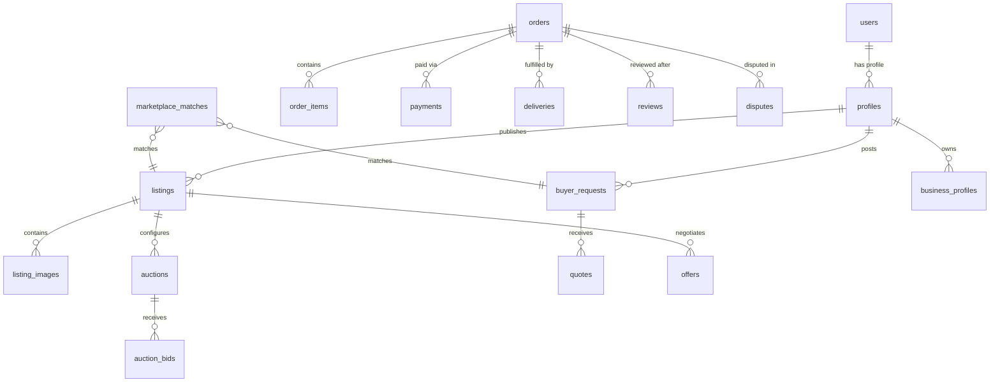

# Servilist Database Architecture & Migration Inventory

**Database Engine**: PostgreSQL 15+ / Supabase  
**Extensions**: `pgcrypto`, `uuid-ossp`, `pg_trgm`  
**Security Model**: Row Level Security (RLS) on all tables with Role-Based Access Control (RBAC)

---

## 1. Migration Inventory

| Migration | Name                                    | Description                                                                           |
| --------- | --------------------------------------- | ------------------------------------------------------------------------------------- |
| `00001`   | `create_profiles`                       | User profiles, usernames, verification badges, location, account status               |
| `00002`   | `create_exchange_rates`                 | Pan-African currency exchange rates and base currencies                               |
| `00003`   | `create_listings`                       | Core listings table supporting classifieds, fixed price, auctions                     |
| `00004`   | `create_buyer_requests`                 | Reverse marketplace buyer requests, budget in minor units, deadlines                  |
| `00005`   | `create_quotes`                         | Seller responses and quotations for buyer requests                                    |
| `00006`   | `create_bids`                           | Auction bid history with bidder references                                            |
| `00007`   | `create_escrow_orders`                  | Initial escrow orders and dispute states                                              |
| `00008`   | `rls_and_policies`                      | Foundation Row Level Security across initial tables                                   |
| `00009`   | `user_rls_policies`                     | User-specific read/write security boundaries                                          |
| `00010`   | `accounts_and_server_side_trades`       | Server-side trade and balance verification                                            |
| `00011`   | `messages_and_auction_settlement`       | Direct chat messaging and initial auction settlement RPC                              |
| `00012`   | `rbac_and_audit_log`                    | Role-based access control, `my_access` RPC, and immutable `audit_logs`                |
| `00013`   | `sprint2_categories_listings_images`    | Hierarchical category trees, multiple listing gallery images                          |
| `00014`   | `sprint3_offers_and_negotiations`       | Direct offers, immutable counter-offer versioning, proposal deadlines                 |
| `00015`   | `sprint4_orders_and_ledger`             | Orders, order items, payments, secret handover OTP, double-entry ledger               |
| `00016`   | `sprint5_reviews_reports_moderation`    | Verified reviews with rating recalculation triggers, KYC verifications, reports queue |
| `00017`   | `sprint6_services_marketplace`          | Professional services catalog, packages JSONB, service bookings                       |
| `00018`   | `sprint7_auctions_and_bids`             | Timed bidding engine, anti-sniping extension, atomic row locking RPC (`place_bid`)    |
| `00019`   | `sprint8_delivery_business_storefronts` | Courier deliveries, tracking events, CAC business profiles, verified tiers            |
| `00020`   | `sprint9_search_and_matching_engine`    | Full-text search tsvectors, pg_trgm similarity, reverse-marketplace matching engine   |

---

## 2. Core Entity Map



---

## 3. Financial Ledger Model (Double-Entry)

All platform money movements are tracked in three immutable tables:

- `ledger_accounts`: User balances, platform fee revenue, platform clearing/escrow account.
- `ledger_transactions`: Grouped financial transaction events with timestamp and reference.
- `ledger_entries`: Debit and credit entries. The sum of debits must strictly equal the sum of credits for every transaction.

```sql
-- Example entry creation on buyer payment
INSERT INTO ledger_entries (transaction_id, account_id, entry_type, amount_minor)
VALUES
    (tx_id, clearing_acc_id, 'credit', 350000000), -- Platform clearing holds funds
    (tx_id, buyer_acc_id,    'debit',  350000000);
```

---

## 4. Key Functions & Stored Procedures

1. `public.place_bid(p_auction_id, p_bidder_id, p_amount_minor, p_max_proxy_minor)`:
   - Locks auction row exclusively (`FOR UPDATE`).
   - Validates auction is active and not ended.
   - Prevents seller from bidding on their own item.
   - Enforces minimum increment.
   - Applies 5-minute anti-sniping extension if bid is placed in final 5 minutes.
   - Updates `current_amount_minor`, `winning_bid_id`, and `total_bids`.

2. `public.find_matching_listings_for_request(p_request_id, p_limit)`:
   - Calculates relevance score across category, budget, city, and full-text search similarity.
   - Returns matched items sorted by relevance score descending.

3. `public.recalculate_seller_rating()`:
   - Trigger on `reviews` insertion/update.
   - Automatically computes `AVG(rating)` and `COUNT(*)` and updates `profiles.rating` and `profiles.reviews_count`.
